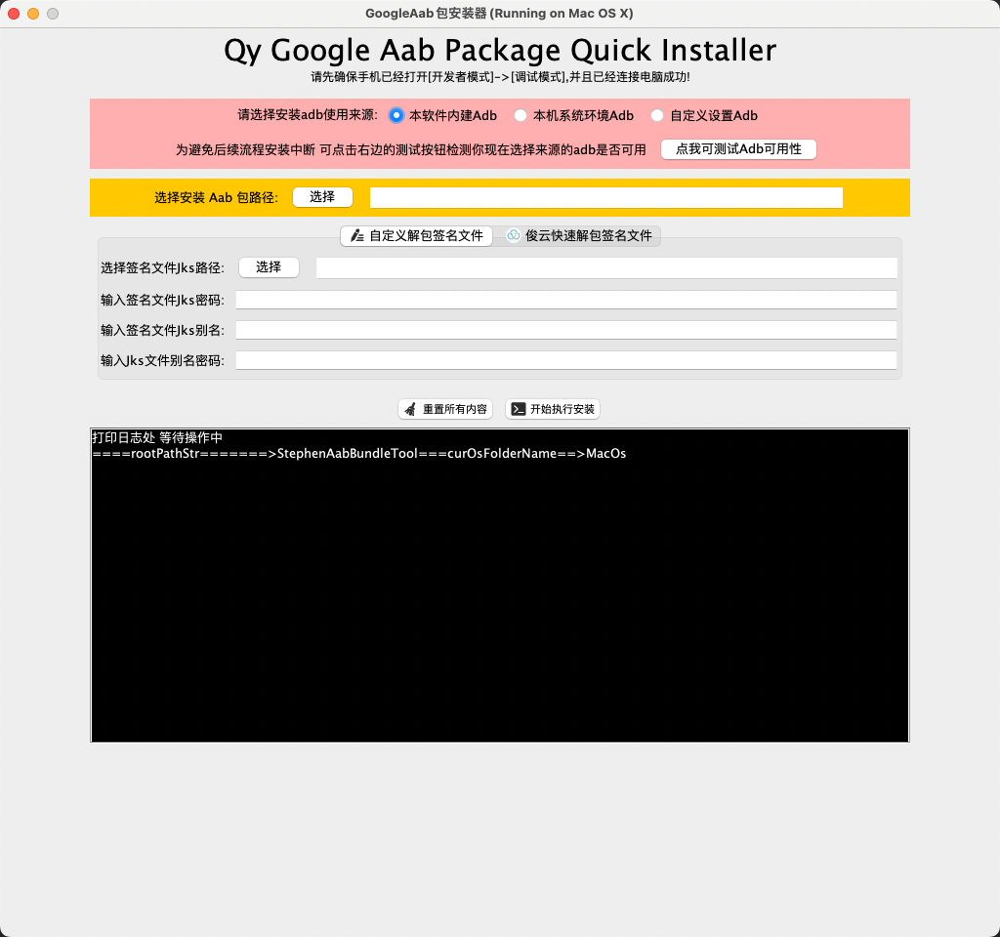
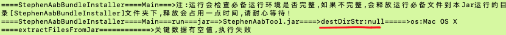
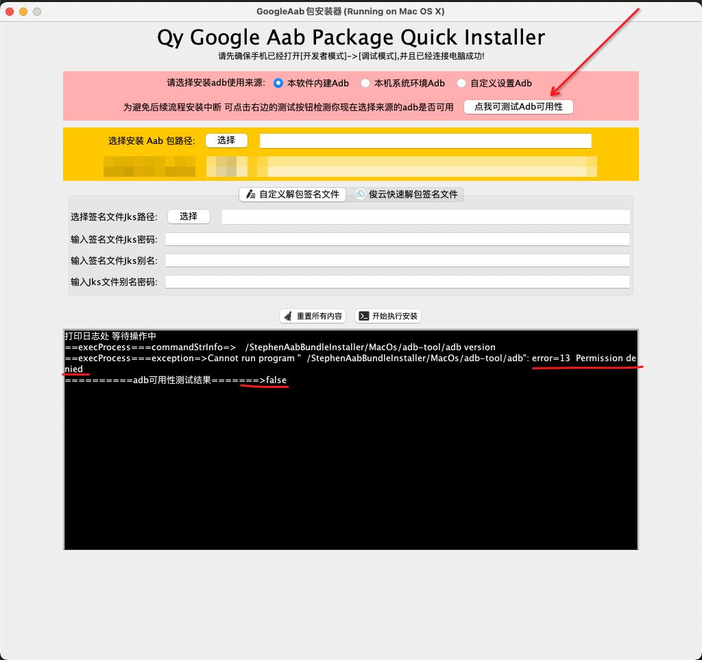
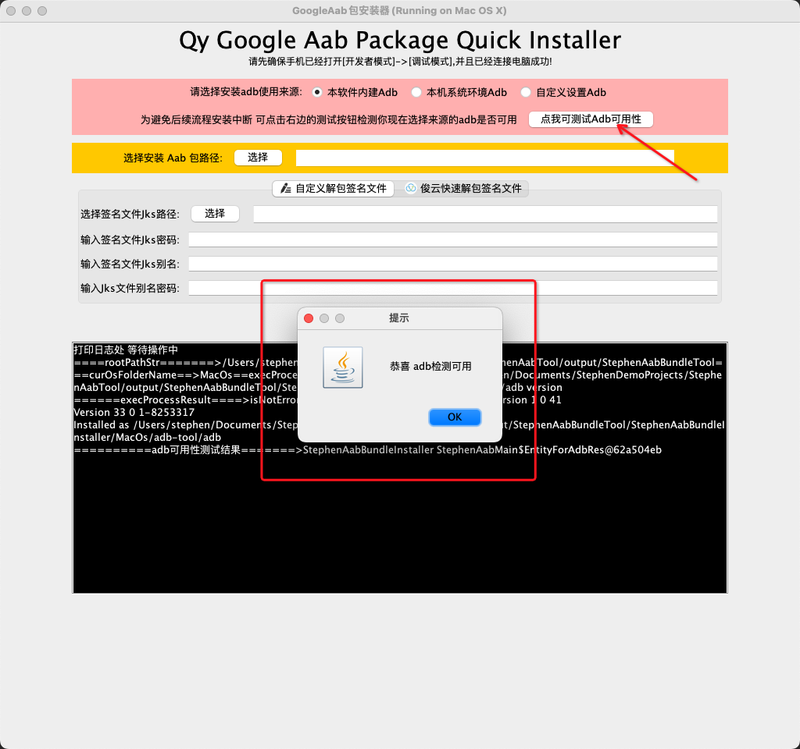
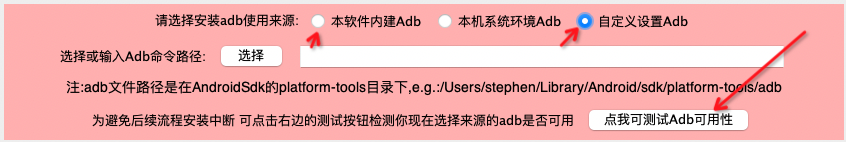
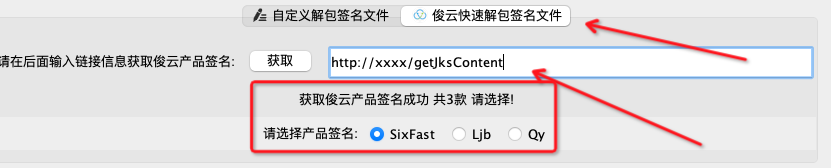

# StephenAabBundleInstaller
## 针对Google的AndroidBundle包aab开发的一个GUI快捷安装工具,使用Java编写,适配Win/Mac/Linux全平台(包含各平台的Jre,Adb),直接运行Release包里面对应平台的startup脚本即可
>Idea来源[AndroidAppBundleIntaller](https://github.com/didikee/AndroidAppBundleIntaller)和[AabInstallHelp](https://github.com/fireantzhang/AabInstallHelp)这两个项目,虽然总体不错,但是这两个项目实际使用感觉还是有点缺点,比如gui支持的平台不全,或者容错处理不够,还有需要安装基础依赖,对非开发人员使用不够好;因此有了这个项目,真正做到开箱即用!

### 运行效果图


### 安装及运行步骤:
1. 下载[https://github.com/woshiluoyong/StephenAabTool/releases/](https://github.com/woshiluoyong/StephenAabTool/releases/)页面的最新压缩包或者代码页面output目录的StephenAabBundleTool文件夹
2. 下载完成后解压StephenAabBundleTool目录包含StephenAabTool.jar为主项目核心文件,包含的Windows/MacOs/Linux为各个平台的java运行环境jre以及启动脚本
3. 请务必按后面步骤运行startup脚本,否则可能会因为没有运行权限而无法运行或者异常
4. <font color=#FF0000>如果你是Windows平台:请进入Windows目录右键```startup.bat```选择[以管理员身份运行]</font>
5. <font color=#FF0000>如果你是Mac/Linux平台:请打开[终端]然后进入Mac/Linux目录 </font>
   - 输入```sudo -i```回车然后输入密码切换成root用户(退出root用户用exit命令,pwd命令查看当前目录)
   - 执行```chmod u+x,o+x startup.sh```
   - 执行```./startup.sh```运行
6. 权限不足可能会导致获取的路径为空导致异常,如下图:
>

### 本条非常重要,请详细阅读及操作
1. startup开始执行本程序会自动检查运行目录下是否存在StephenAabBundleInstaller目录,以及该目录下的子文件夹assets/libs/以及对应平台的运行环境,如果不完整,会自动释放StephenAabTool.jar里面对应的环境文件,此过程可能有点慢,请耐心等待完成;
2. <font color=#FF0000>释放完成后强烈需要对生成的StephenAabBundleInstaller目录以及子文件授予运行权限,否则可能无法运行里面文件或者一直校验必备运行环境不完整,每次都执行释放操作 
    - Mac/Linux在[终端]用上步的root用户下执行```chmod -R 777 /Users/stephen/Documents/xxxxxx/StephenAabTool/output/StephenAabBundleTool/StephenAabBundleInstaller```
    - Windows可在生成的```xxxx/StephenAabBundleTool/StephenAabBundleInstaller```目录上右键属性里面修改该文件夹和子文件权限修改</font>
3. 修改后可先点击界面上的```点我可测试Adb可用性```按钮,然后查看界面上日志是否包含有"Permission denied"判断是否权限不足导致adb不可用,修改权限直至adb运行成功为止,如下图:



>如果某些原因,内部包含的环境版本太老或者不兼容,可自己替换释放生成的StephenAabBundleInstaller目录里面的adb/jre/bundletool等!,提供部分下载便捷地址如下:
>[AndroidSdk包含adb相关](https://www.androiddevtools.cn/)
>Jdk下载:[TUNA镜像](https://mirrors.tuna.tsinghua.edu.cn/AdoptOpenJDK/),[HUAWEI镜像](https://repo.huaweicloud.com/java/jdk/),[injdk](https://www.injdk.cn/),[编程宝库](http://www.codebaoku.com/jdk/jdk-index.html),[jdk下载](https://jdkdownload.com/)

>本系统释放的StephenAabBundleInstaller目录里面包含一个对应平台的adb为界面上显示的"本软件内建adb",如果希望自定义adb路径可选择"自定义设置adb",选择一个精确的adb路径,选择后可点击测试按钮是否有效,如下图:
>

>本系统为方便公司内部使用,避免手填签名文件jks的繁琐,因此做了接口拉取选择,使用上只需填写正确的接口获取签名文件选择即可,接口需为Get请求格式且按如下格式返回:
>```json
>[{
>    "jksName": "SixFast",
>    "jksFilePath": "http://127.0.0.1/xxxx/xxxx.jks",
>    "jksFilePwd": "xxxx",
>    "jksAlias": "xxxx",
>    "jksAliasPwd": "xxxx"
>},{
>    "jksName": "Ljb",
>    "jksFilePath": "http://127.0.0.1/xxxx/xxxx.jks",
>    "jksFilePwd": "xxxx",
>    "jksAlias": "xxxx",
>    "jksAliasPwd": "xxxx"
>},{
>    "jksName": "Qy",
>    "jksFilePath": "http://127.0.0.1/xxxx/xxxx.jks",
>    "jksFilePwd": "xxxx",
>    "jksAlias": "xxxx",
>    "jksAliasPwd": "xxxx"
>}]
>```
>

>因手头暂无linux系统,因此linux系统的没咋测试,但和mac相差不大,如有问题,可参考简单修改即可正常运行